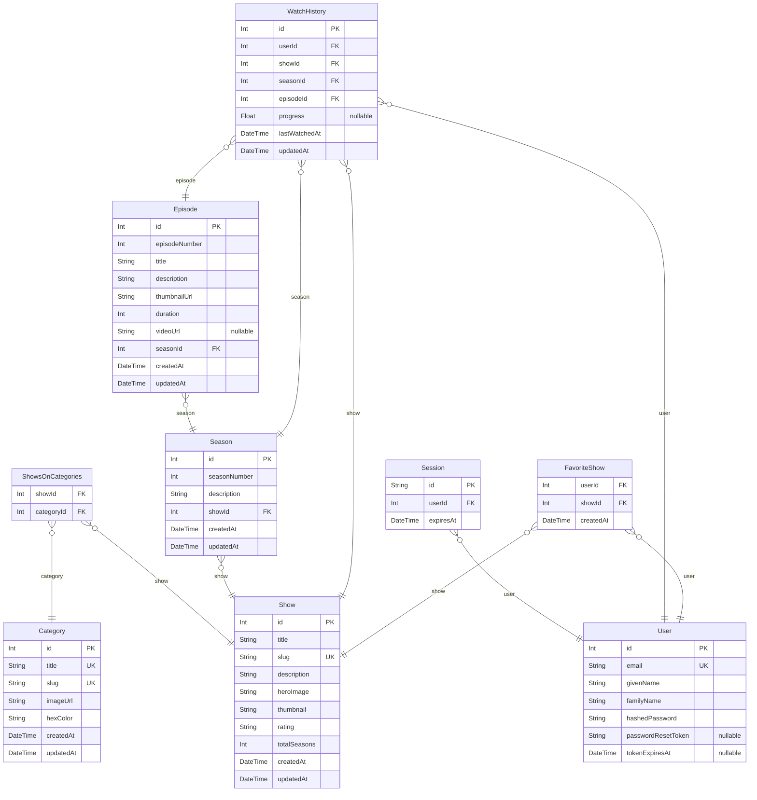

# Schema Markdown
> Generated by [`prisma-markdown`](https://github.com/samchon/prisma-markdown)

- [default](#default)

## default

### `User`
The User table stores all registered users of the streaming platform
This is a core table that manages user authentication, personal details, and links to all user-specific features
It maintains relationships with sessions, watch history, and favorited shows
All user interactions and personalization features stem from this table

**Properties**
  - `id`
    > Unique identifier for the user, automatically increments with each new user
    > This is the primary key used to link users across all related tables
  - `email`
    > User's email address used for login and communication
    > Must be unique across the platform to prevent duplicate accounts
    > Used as the primary means of user identification during authentication
  - `givenName`
    > User's first name
    > Used for personalization and display purposes throughout the platform
  - `familyName`
    > User's last name/family name
    > Used alongside givenName for full name display and user identification
  - `hashedPassword`
    > Securely hashed version of the user's password
    > Never stores plain text passwords for security
    > Used for authenticating user login attempts
  - `passwordResetToken`
    > Temporary token generated when user requests password reset
    > Nullable as it's only populated during active reset requests
    > Should expire after a set time period
  - `tokenExpiresAt`
    > Timestamp indicating when the password reset token expires
    > Used to invalidate old reset tokens for security
    > Nullable as it's only relevant when passwordResetToken is set

### `Session`
The Session table manages active user authentication sessions
It tracks all active logins across different devices and browsers
Handles session expiration and cleanup for security
Enables features like "remember me" and multi-device login management

**Properties**
  - `id`
    > Unique identifier for the session, typically a UUID
    > Used to identify specific login instances across the platform
  - `userId`
    > Foreign key reference to the user who owns this session
    > Links each session to a specific user account
  - `expiresAt`
    > Timestamp when this session should be considered invalid
    > Used for automatic session cleanup and security enforcement
    > Helps prevent unauthorized access through old sessions

### `Category`
The Category table defines different genres and content classifications
Used for content organization, filtering, and discovery
Provides both functional categorization and UI presentation data
Essential for content browsing and recommendation features

**Properties**
  - `id`
    > Unique identifier for the category
    > Primary key used in relationships and queries
  - `title`
    > Display name of the category (e.g., "Action", "Comedy", "Drama")
    > Must be unique to prevent duplicate categories
    > Used in UI for category display
  - `slug`
    > URL-friendly version of the title for routing
    > Used in URLs for SEO and clean links
    > Automatically generated from title
  - `imageUrl`
    > URL to the category's display image
    > Used in UI for visual representation
    > Should be consistent size/format for UI harmony
  - `hexColor`
    > Hex color code used for category-specific theming
    > Used in UI for visual distinction between categories
    > Should meet accessibility contrast requirements
  - `createdAt`
    > Timestamp of when this category was first created
    > Automatically set on record creation
  - `updatedAt`
    > Timestamp of the last update to this category
    > Automatically updated on record modification

### `Show`
The Show table represents individual series or programs
This is the main content table storing all streamable shows
Contains all metadata and relationships for show management
Central to the platform's content organization

**Properties**
  - `id`
    > Unique identifier for the show
    > Primary key used across all show-related features
  - `title`
    > Name of the show as displayed to users
    > Main identifier for users browsing content
  - `slug`
    > URL-friendly version of the show title
    > Used for clean, SEO-friendly show URLs
    > Must be unique across all shows
  - `description`
    > Detailed description of the show
    > Used in show details page and cards
    > Provides users with show synopsis
  - `heroImage`
    > URL to the show's large format image
    > Used for hero/banner displays
    > Should be high resolution for quality display
  - `thumbnail`
    > URL to show's smaller format image
    > Used in cards and list views
    > Optimized for faster loading in lists
  - `rating`
    > Content rating (e.g., "PG", "MA", "TV-14")
    > Used for parental guidance and filtering
  - `totalSeasons`
    > Total number of seasons in the show
    > Quick reference without counting seasons
    > Defaults to 1 for new shows
  - `createdAt`
    > Timestamp of when the show was added
    > Helps with "New Arrivals" features
  - `updatedAt`
    > Timestamp of last show update
    > Tracks content freshness

### `ShowsOnCategories`
The ShowsOnCategories table manages the many-to-many relationship between shows and categories
Enables shows to belong to multiple categories and categories to contain multiple shows
Essential for content organization and discovery features
Provides efficient querying for category-based show listings

**Properties**
  - `showId`
    > Foreign key for the associated show
    > Part of composite primary key
  - `categoryId`
    > Foreign key for the associated category
    > Part of composite primary key

### `Season`
The Season table represents individual seasons of shows
Contains season-specific metadata and episode organization
Enables hierarchical content organization within shows
Facilitates season-based navigation and tracking

**Properties**
  - `id`
    > Unique identifier for the season
    > Primary key used in relationships and queries
  - `seasonNumber`
    > Number of this season within its show
    > Used for ordering and display purposes
  - `description`
    > Season-specific description/synopsis
    > Provides context for this particular season
  - `showId`
    > Foreign key for the associated show
    > Enables show-season relationship
  - `createdAt`
    > Timestamp of season addition
    > Tracks when season was added to platform
  - `updatedAt`
    > Timestamp of last season update
    > Tracks content modifications

### `Episode`
The Episode table stores individual episodes within seasons
Contains episode-specific content and metadata
Represents the actual viewable content units
Tracks individual episode progress and viewing

**Properties**
  - `id`
    > Unique identifier for the episode
    > Primary key used across the platform
  - `episodeNumber`
    > Number of this episode within its season
    > Used for ordering and display purposes
  - `title`
    > Title of this specific episode
    > Displayed in episode lists and details
  - `description`
    > Episode-specific description/synopsis
    > Provides context for this particular episode
  - `thumbnailUrl`
    > URL to episode's preview image
    > Used in episode lists and details
  - `duration`
    > Length of episode in minutes
    > Used for progress tracking and display
  - `videoUrl`
    > URL to the actual video content
    > Optional for future video implementation
    > Null when video isn't available yet
  - `seasonId`
    > Foreign key for associated season
    > Enables season-episode relationship
  - `createdAt`
    > Timestamp of episode addition
    > Tracks when episode was added
  - `updatedAt`
    > Timestamp of last episode update
    > Tracks content modifications

### `WatchHistory`
The WatchHistory table tracks all user viewing activity
Enables progress tracking and "Continue Watching" features
Critical for personalization and user experience
Maintains hierarchical viewing history at all levels

**Properties**
  - `id`
    > Unique identifier for this watch history entry
    > Primary key for tracking individual viewing sessions
  - `userId`: Foreign key for associated user
  - `showId`: Foreign key for associated show
  - `seasonId`: Foreign key for associated season
  - `episodeId`: Foreign key for associated episode
  - `progress`
    > Percentage of episode watched
    > Enables resume playback feature
    > Null if not started watching yet
  - `lastWatchedAt`
    > When this episode was last watched
    > Used for "Continue Watching" sorting
  - `updatedAt`
    > Timestamp of last progress update
    > Tracks viewing session updates

### `FavoriteShow`
The FavoriteShow table manages user-favorited content
Enables users to bookmark shows they like
Used for personalization and quick access features
Supports favorite-based recommendations

**Properties**
  - `userId`: Foreign key for associated user
  - `showId`: Foreign key for associated show
  - `createdAt`
    > When this show was favorited
    > Used for sorting favorites